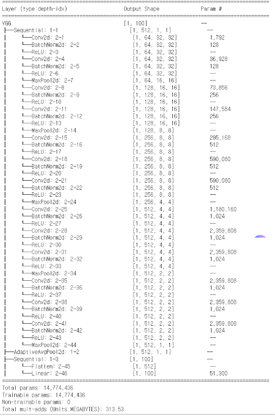
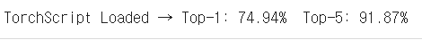
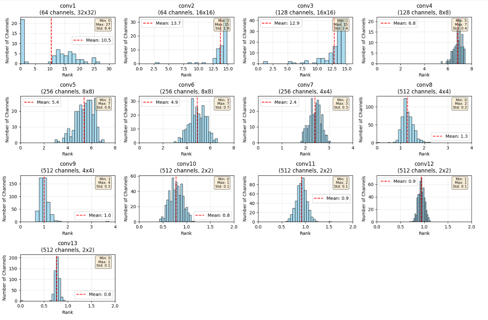
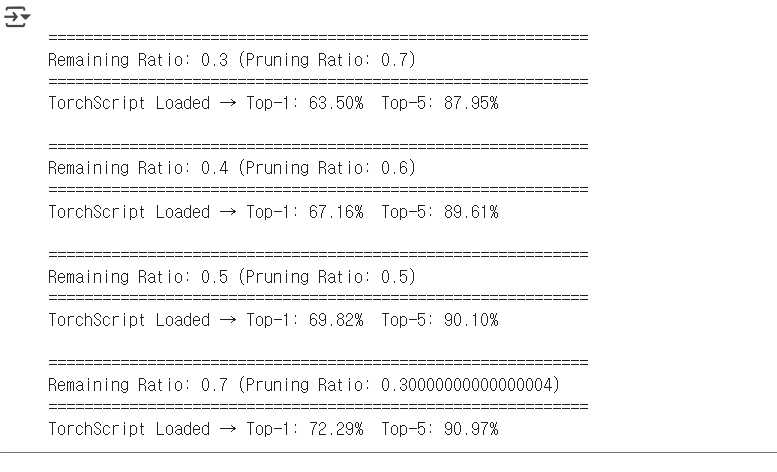

# ✂️ 프루닝 실습 (2025.10.01)

> VGG16_BN 모델을 Hrank 방법으로 프루닝하고 CIFAR-100 데이터셋으로 성능을 확인하는 실습입니다.

- **- Model**: `vgg16_bn`
- **- Method**: `Hrank`
- **- Dataset**: `CIFAR-100`

---

## 🔎 원본 모델 분석

<table>
  <tr align="center">
    <td width="50%" style="vertical-align: top;">
      <h3>🏛️ 모델 구조</h3>
      
    </td>
    <td width="50%" style="vertical-align: top;">
      <h3>📝 모델 파라미터</h3>
      
      <h3>🎯 모델 정확도</h3>
      
    </td>
  </tr>
</table>

---

## 🚀 프루닝 및 파인튜닝 결과

<h3 align="center">📈 랭크 계산 결과</h3>

  

<h3 align="center">✨ 파인튜닝 결과</h3>

  <strong>Remaining Ratio = [0.3, 0.4, 0.5, 0.7]</strong>

  

